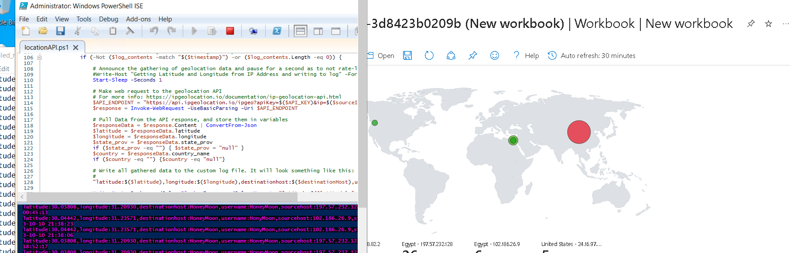
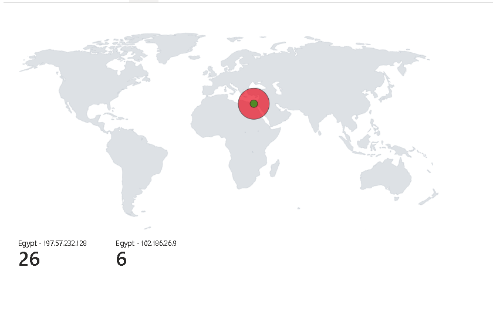
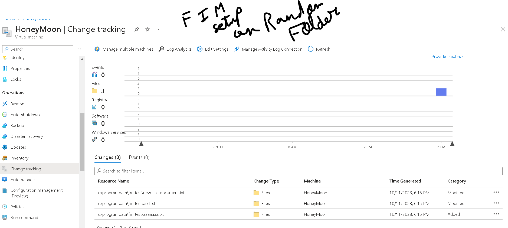
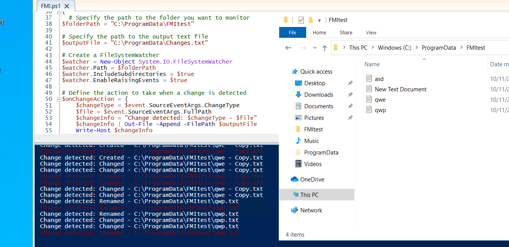

# SIEM Project

Welcome to the Security Information and Event Management (SIEM) project built on Azure. This SIEM system is designed to monitor and analyze security events, including failed login attempts, through a File Integrity Monitoring (FIM) component. It also provides a visual map to display failed login events for incident response.

## Table of Contents
- [Project Overview](#project-overview)
- [Features](#features)
- [Getting Started](#getting-started)

## Project Overview

This SIEM project leverages Azure services to provide robust security monitoring and incident response capabilities. It combines File Integrity Monitoring with a visual map for failed login events, enabling security professionals to detect and respond to security threats effectively.

## Features

- File Integrity Monitoring (FIM)
- Visual Map for Failed Login Events
- Real-time Security Event Monitoring
- Incident Response Support

## Getting Started

To get started with the SIEM project, follow these steps:

1. [Installation](#installation): Set up the SIEM system on Azure.
2. [Usage](#usage): Learn how to use the SIEM for security event monitoring and incident response.

## Map screenshots with live attacks.
   
   

## FIM through change history and alert.
   
   
